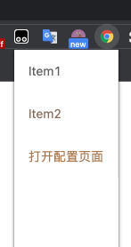
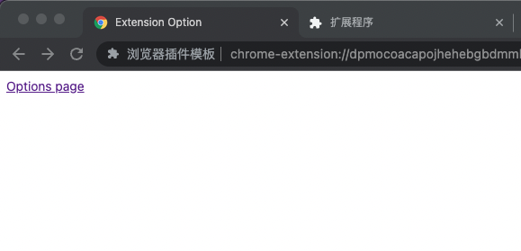
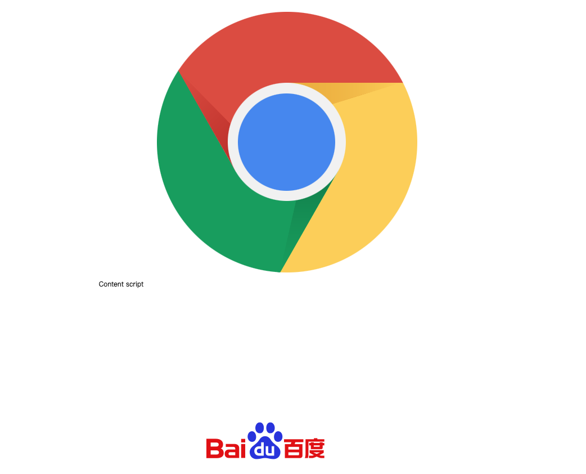

# Chrome Extension React Template


这是一个Chrome插件的项目模板，支持react，UI库使用了antd。抽象了一些常见的基础库，如日志、消息通信。可以快速构建出一个react的插件。

## 特性
* 支持react
* 封装了通用的消息通信
* 支持日志采集
* 快速搭建项目
* 支持环境配置(development/production/tests)

## 构建

```bash
$ npm install
$ npm run build
```

构建后会在```extension```生成相应的文件。在浏览器加载插件就可以运行了。


## 截图

Popup



配置页



内容脚本注入




## 项目布局

### ```/src/backgorund.js```
后台脚本入口


### ```/src/content-scripts.js```

内容脚本入口

### ```/src/content-options.js```

插件配置入口

### ```/src/components/```

一些通用的react组件

### ```/src/lib```

一些通用的库，如日志、消息通信、浏览器接口相关的函数

#### ```/src/lib/message.js```

消息类

监听消息：

```js
const message = new Message();

message.addListener('ping', function (request, sender, sendResponse) {
  sendResponse('pong');
});

import { dispatchMessage } from "./brower";


// 分发消息
dispatchMessage(message);
```

发送消息:
```js
const message = new Message();
message.sendMessage('ping').then(response => {
    console.log('pong');
});
```

#### ```/src/lib/logger.js```

日志类，支持console和http方式记录日志。

```js
import { Logger, HttpHandler, ConsoleHandler } from "./lib/logger";

// 使用HTTP记录日志到服务器
const logger = new Logger('HTTP', new HttpHandler('https://log.youdomain.com/collect/'));
logger.info('some message from client');

// 记录日志到控制台
const consoleLogger = new Logger('CONSOLE', new ConsoleHandler());
consoleLogger.info('message to console');

```

### 在content-script使用插件内的资源（文件、html、css等）

```js
import { getURL } from "./brower";

getURL('/images/chrome-icon.png');
```
